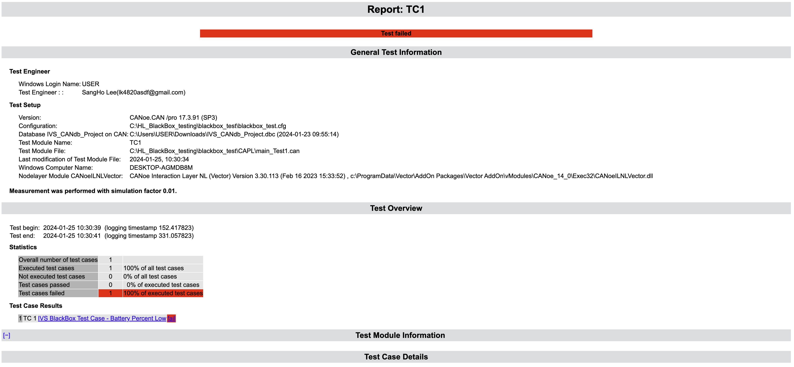
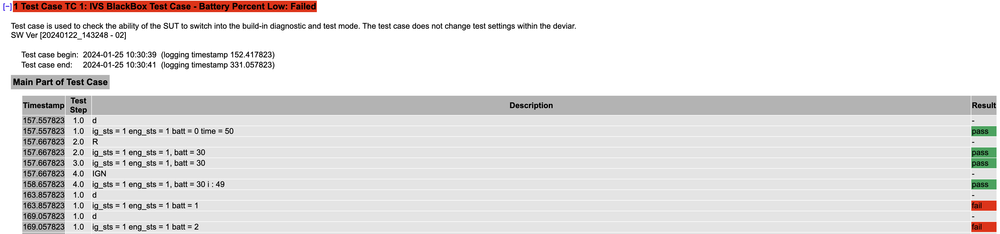
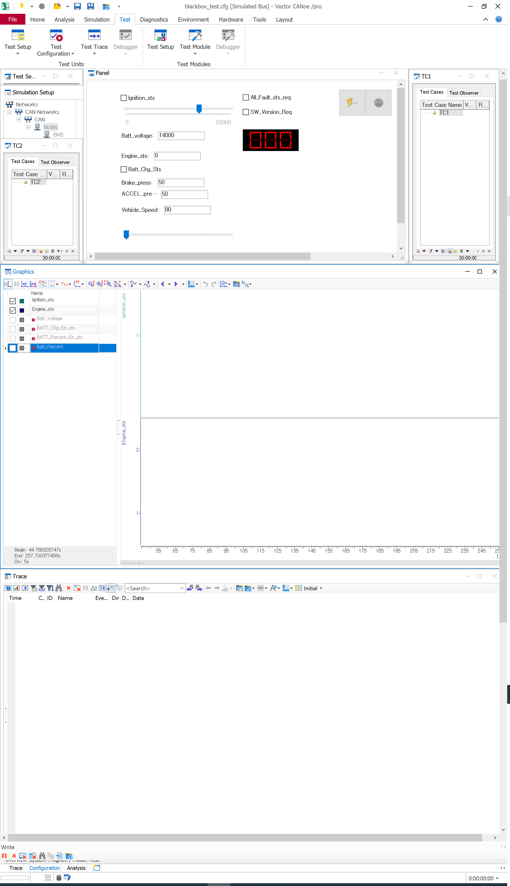

# BlackBox_Testing

    차량 Simulation하고 CAN통신을 통해 테스트 환경에 값을 입력해줌, 자동화는 가상 ECU를 만들어서 차량 CAN메시지한테  00값 보내라고 함 ⇒ 실제 ECU와 가상 ECU가 동일한 입력값을 받음
    ⇒ 검증 대상을 출력해서 실제 출력, 가상 출력을 비교 및 판정 (Pass/Fail)

-----------

### 자동화 테스팅 수행

-------------

### 패널 테스팅 환경
